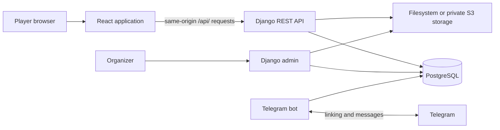

# Architecture

## Components and request flow

The application separates the browser interface, the HTTP API, persistent records, uploaded files, and Telegram delivery.

Nginx serves the built frontend and forwards API requests to Django. React Router resolves pages and loads their data. Shared API helpers attach session cookies and CSRF headers, then turn server validation failures into errors shown by the relevant form. PostgreSQL stores the domain records; image and file contents are stored separately.

The principal source boundaries are `frontend/src/app/` for routing and page data, `frontend/src/features/` for the user interface, `backend/apps/` for the domain and API, and `backend/bot/` for Telegram handlers and delivery jobs.

## Domain relationships

| Entity | Relationships and responsibility |
| --- | --- |
| User | Player identity, private profile, public social preferences, liked characters, Telegram connection |
| Game | Event information, registration/publication flags, groups, applications, associated questions |
| Group | Faction or family in a game, optionally nested under another group |
| Character | Faction, optional family, tags, portrait, optional assigned application |
| Application | Player and game, status, optional character, fee, amount paid, answers |
| Question | Reusable across games; field type, choices, ordering, required flag |
| Answer | A question's JSON value for an application |
| Mailing / Notification | Scheduled message and its per-recipient delivery state |

Application creation and answer saving lock the player row inside a database transaction. This serializes concurrent requests for the same player and prevents the normal create/save path from creating duplicate applications. Character assignment is represented by an optional one-to-one relation on the application. The application's status and answers survive player withdrawal because withdrawal changes status rather than deleting the row.

Group visibility is resolved from each game's root groups down through visible descendants. Hidden ancestors exclude their entire branch. Public character queries require a visible faction and either a visible family or no family. Cycles and parent links outside the game's hierarchy are excluded from that traversal.

## Pages and data access

| Route | Main purpose |
| --- | --- |
| `/` | Whales game landing page |
| `/game/:game_alias/about` | Game information |
| `/game/:game_alias/roles` | Role grid by faction or family |
| `/game/:game_alias/characters` | Search and tags |
| `/account/:game_alias/application` | The current player's application |
| `/account/:game_alias/questionnaire` | Answers for that application |
| `/account/settings?game=:game_alias` | Profile and Telegram settings in the selected game's account layout |
| `/sign-in`, `/sign-up`, `/sign-out` | Authentication |
| `/mg` | Staff-restricted master-group listing |
| `/organizer`, `/organizer/new`, `/organizer/:game_id` | Authorized game listing, creation and editing |

Game and role pages consume public representations. Application and profile operations require authentication and limit access to the current player. The organizer cabinet has a separate game-editing contract; Django admin supplies the other management workflows. [Application behavior](application.md) describes the user-facing lifecycle.

`/api/organizer/games/` lists game content, effective game permissions and the application's time zone, and accepts creation requests. `/api/organizer/games/{id}/` reads and patches a game. Every endpoint checks active organizer status and Django model permissions. Responses are marked `no-store`; organizer fields are not added to public serializers. The stored player capacity and default fee are available through this private contract.

An update supplies `expected_revision`, a digest of the editable values read earlier. Inside a transaction, the API locks the game row, compares the digest, and returns HTTP 409 on a stale edit. A case-insensitive database constraint prevents duplicate aliases, including concurrent creation. Successful writes use ordinary model saves, reuse post-commit cache invalidation and record changed field names in Django's admin log. The editor preserves its draft on validation, network and conflict errors.

## Sessions and API contracts

`/api/session/` returns the current user and a CSRF token, accepts login, and ends a session on logout. `/api/session/register/` creates the user and establishes the browser session. Browser mutations use same-origin cookies and an `X-CSRFToken` header. The frontend does not persist API authentication tokens in browser storage; token endpoints remain available for other clients.

Private profile serializers and public player serializers have different field sets. Public game responses therefore do not need the complete user profile. Social-link fields also respect the user's public visibility preferences. Session responses carry `Cache-Control: no-store`.

OpenAPI is derived from Django serializers, views, and schema annotations. The live schema is exposed at `/api/schema/` and rendered by Swagger at `/api/docs/`. Its committed representation is [backend/openapi.yaml](../backend/openapi.yaml); [frontend API types](../frontend/src/shared/api/schema.ts) are generated from that schema. This connects the backend's request/response definitions to the frontend's TypeScript contracts.

## Public response caching

Public game, group, character, and tag payloads use a cache with a nominal lifetime of 60 seconds. Each game has a cache-version key. Changes to relevant models and relations schedule invalidation after the database transaction commits, advancing the version so a request still building an old payload cannot repopulate the current cache namespace. Queries inside an active transaction bypass this shared cache.

The invalidation dependencies include character assignment and publicly displayed user fields. Bulk writes that bypass Django's model signals depend on explicit invalidation. Authenticated profile and application data are not stored in this public payload cache. Authentication and one-time-code issuance have separate rate limits.

## Files and images

Django file fields store relative file names, while the storage backend holds the bytes. The filesystem backend serves local media. The S3-compatible backend stores files in a private bucket and provides time-limited signed URLs. Public payload cache lifetimes are shortened when necessary so cached URLs retain time to load before expiring.

Avatars, character portraits, character files, and rich-text uploads share this storage boundary. The browser crops an avatar before submitting the resulting file in a multipart profile request. Portrait fallbacks are frontend assets associated with each game and can still display when an uploaded portrait is missing or fails to load. Database backups and media contents are separate assets.

## Telegram and notification delivery

The API issues an action-scoped `OneTimeToken` for Telegram linking and returns a deep link. Only a digest of the token is stored. The bot receives the code in a private chat and consumes it atomically while associating that chat with the player. Expiration, action scope, and consumed state determine whether the code is accepted.

The API and bot use the same Django models and database, so the bot does not need to impersonate a browser session. A scheduled bot job runs every minute, selects due unsent notifications for linked chats, sends their text, and marks successful deliveries as sent. A send failure leaves the notification available for retry. This records successful sends; it is not a guarantee of exactly-once delivery if a process stops between sending a message and recording its result.
